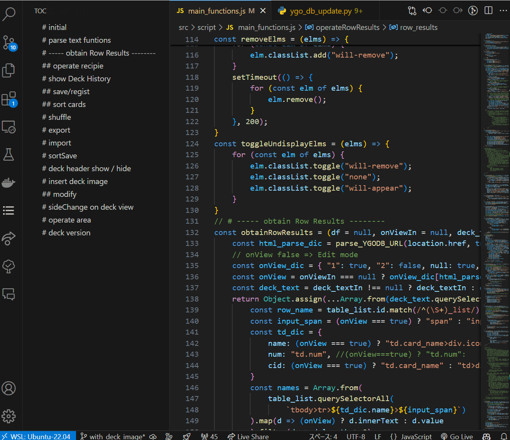

# Manualized Toc for VSCode

## Install

You can install this extension with `manualized-toc-X.X.X.vsix` in `Extension: install from VSIX` at Command Pallet (Ctrl+Shift+P) or from VSCode Extension Store (search `Manualized Toc`).

## feature

This extension adds TOC into the sidebar whose contents are made from the file content.

- TOC with Comment Symbols (for program languages): `comment symbol + # + HeaderTitle` (the number of `#` means the header level)
    - c, cpp, js: `// #`
    - python: `# #`
    - php: `# #` or `// #`
    - you can add spaces or tabs before/after comment symbol.
- TOC with Header Symbols: `^#+ HeaderTitle` (the number of `#` means the header level). You can edit the header symbol in the config instead of using `#`.

You can move by clicking the content in TOC such like Jupyter TOC extension.

## Config

You can edit config about the following items:

- **`manualized_toc.depth_in_toc`**: This setting controls the depth of contents shown in the Table of Contents (TOC). It accepts integer values from 0 to 6, where contents with a larger depth than the specified value are folded as children in the TOC. If a non-positive value is inputted, no contents are folded. The default value is 3.

- **`manualized_toc.require_spaces_after`**: This boolean setting determines whether spaces are required after header symbols in the TOC. The default value is `false`, meaning that spaces after header symbols are not required by default.

- **`manualized_toc.comment_symbols`**, **`manualized_toc.header_symbols`**: This configuration allows users to specify comment out and header symbols per language for generating the Table of Contents (TOC). It is an object where keys are language identifiers and values are arrays of strings representing the symbols used for headers in those languages. This enables customization of how headers are recognized in different programming languages.

## Update

### 1.3.0 (2024-07-15)

- Fixed the bug that the config is not sometimes reflected.
- Excluded code blocks in Markdown when generating TOC.
- Renamed the extension from `manualized_toc` to `Manualized TOC`.
- Added the icon for the extension.
- Rewrited the script with TypeScript insted of JavaScript. (And Refactored the code)

### 1.0.0 (2023-11-03)

Now you can edit config about comment out / header symbols per language! (added in v1.0.0 on 2023-11-03)

You can check languageId to specify the file types on https://code.visualstudio.com/docs/languages/identifiers#_known-language-identifiers .